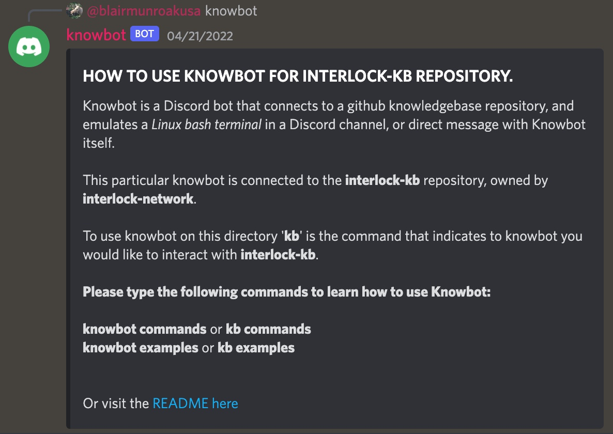
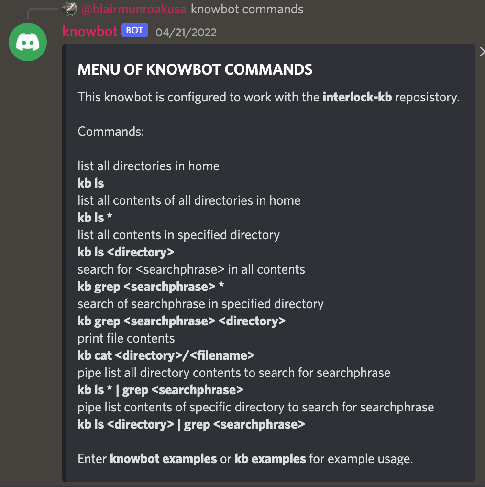
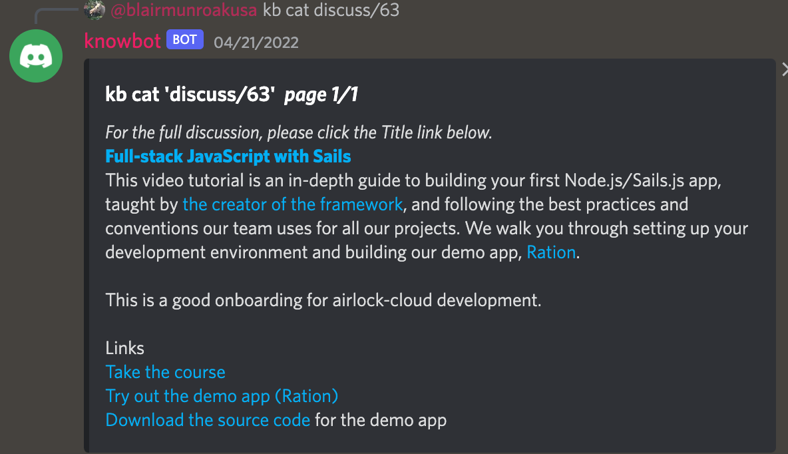
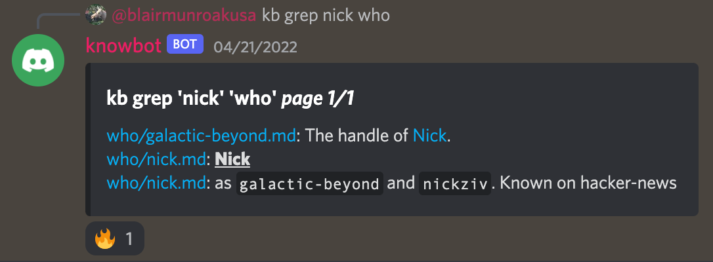

# Knowledgebase Discord Bot (knowbot)

This repository contains code for the Interlock knowledgebase Discord bot, or **_knowbot_** for short. The concept was spawned from an interlock-kb issue, transferred to a discussion in this repository for records' sake: [Original Knowbot Issue #32](https://github.com/interlock-network/knowbot/discussions/32). We basically wanted a way to easily access our organization's knowledgebase from Discord, which is our team's primary communication tool.

##### In short form, the Knowbot is intended to emulate/mimic the classic Unix-style bash terminal (a tool that computer geeks and hackers love) within Discord. A terminal is an interface (screen and a keyboard) that lets you interact with a computer. The knowbot Discord terminal, instead of connecting to a filesystem on a computer, connects to the filesystem within a _Github repository_. The purpose of a Knowbot is to connect to and explore a knowledge base repository with the following flat directory structure:

```
knowledgebase-repo
.
├── README.md
├── directory1
│   ├── README.md
│   ├── topic1.md
│   ├── topic2.md
│   └── topic3.md
|	...
├── directory2
│   ├── README.md
│   ├── entry1.md
│   ├── entry2.md
│   └── entry3.md
|	...
├── directory3
│   ├── README.md
│   ├── etc1.md
│   ├── etc2.md
│   ├── etc3.md
│   └── etc4.md
|	...
├── homefile1.md
└── homefile2.md
    ...
```
In short time, Interlock will provide a public instance of knowbot for community members to tinker with on our Interlock server. For now we are tinkering in a private channel, but the bot is available for anybody to clone/fork and do what they wish.

Developing, we determined that 'kb' command prefix  must be reconfigurable, with the eventual goal of linking a single knowbot to multiple repositories within an organization.

Check issues for allll the juicy issues.

Feel free to start a discussion.

In the near future, we will be incentivizing contribution with INTR token.

We will also be implementing INTR token utilities within knowbot.

Here are some screenshots illustrating various commands and some examples of knowbot in its current form.

### Some snapshots of the first release looks like this:











### Dependencies:

[Please see references for project and dependencies here.](./REFERENCES.md)

### Setup:

[A nondetailed overview for setup is here.](./SETUP.md).


