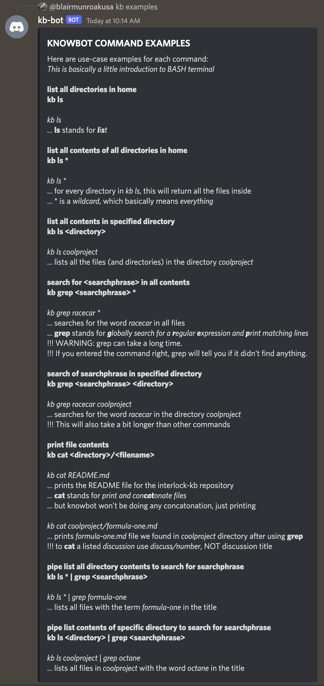

# Knowledgebase Discord Bot (Knowbot)

This is the repository for the Interlock knowledgebase Discord bot, or **_Knowbot_** for short. The idea came from an earlier issue that we have since transferred to a discussion in this repo for transparency: [Original Knowbot issue #32](https://github.com/interlock-network/knowbot/discussions/32). Basically, we wanted a way to access our organization's knowledgebase from Discord, which is our team's primary communication tool.

Knowbot mimics the Linux-style bash terminal within Discord. Power users use the terminal by default to access their files. When you use Knowbot, instead of accessing the filesystem on your computer, you connect to the filesystem within a _Github repository_. Knowbot lets you connect to and explore a knowledge base repo with the following flat directory structure:

```
knowledgebase-repo
.
├── README.md
├── directory1
│   ├── README.md
│   ├── topic1.md
│   ├── topic2.md
│   └── topic3.md
|	...
├── directory2
│   ├── README.md
│   ├── entry1.md
│   ├── entry2.md
│   └── entry3.md
|	...
├── directory3
│   ├── README.md
│   ├── etc1.md
│   ├── etc2.md
│   ├── etc3.md
│   └── etc4.md
|	...
├── homefile1.md
└── homefile2.md
    ...
```

Interlock will soon provide a public instance of Knowbot for community members to tinker with on our [Interlock Discord server](https://bit.ly/intldiscord). For now we are tinkering in a private channel, but the bot is available for anybody to clone/fork and do what they wish.

Developing, we determined that `kb` command prefix (see below) must be reconfigurable, with the eventual goal of linking a single Knowbot to multiple repositories within an organization.

Look at our [issues](https://github.com/interlock-network/knowbot/issues) to see what we're working on.

Check out our [discussions](https://github.com/interlock-network/knowbot/discussions) to see what we're talking about -- and feel free to start a new discussion!

In the near future, we will be incentivizing contribution to the Interlock codebase with \$INTR token. We will also be implementing \$INTR token utilities within Knowbot.

### Some snapshots of the first Knowbot release:

_This Knowbot is connected to the Interlock internal knowledgebase._

##### Initial Help Page

_command:_ `knowbot`


##### List Commands

_command:_ `knowbot commands`


##### Examples of Commands

_command:_ `kb examples`



_command:_ `kb cat discuss/63` (print discussion #63)


_command:_ `kb grep nick who` (search for 'nick' in the 'who' directory)


_command:_ `kb ls` (list all home directories)


_command:_ `kb ls how` (list all files in the 'how' directory)


### Dependencies:

[Please see references for project and dependencies here.](./REFERENCES.md)

### Setup:

[A nondetailed overview for setup is here.](./SETUP.md)
